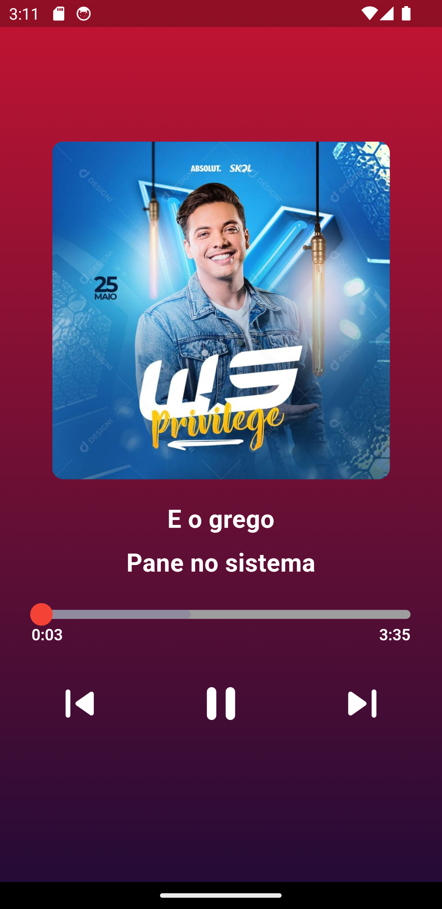

# playxenos

Aplicativo de audio.

## Ínicio

Este aplicativo teve como base de estudo a necessidade de reproduzir audio em background, aplicativo muito simples, só execuçaõ de audio mesmo, os audios são executados a partir de streaming, audio armazenados fora do dispositivo.

## O que foi usado?
Na construção do app foi utilizado o just_audio um package bem conhecido, e um não tão conhecido que é o just_audio_background, com a utilização desses dois pacotes foi possível a realização do projeto, a gerencia de estado foi somente o streamBuilder mesmo, sem necessidade de pacotes adicionais.

## Screen

    

